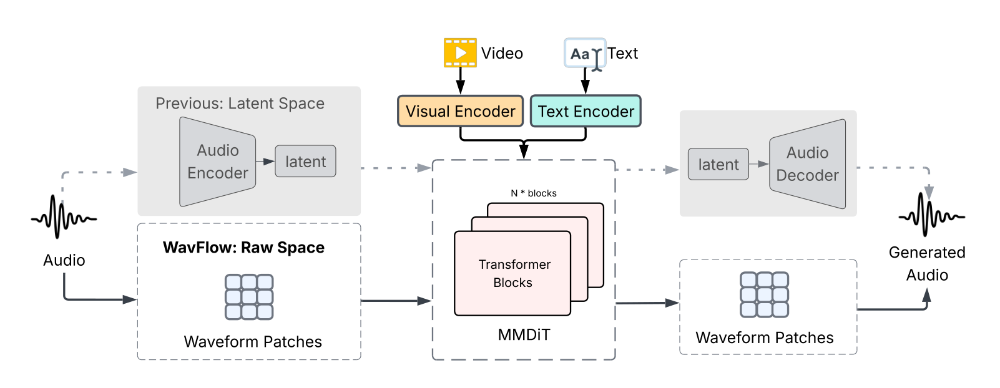
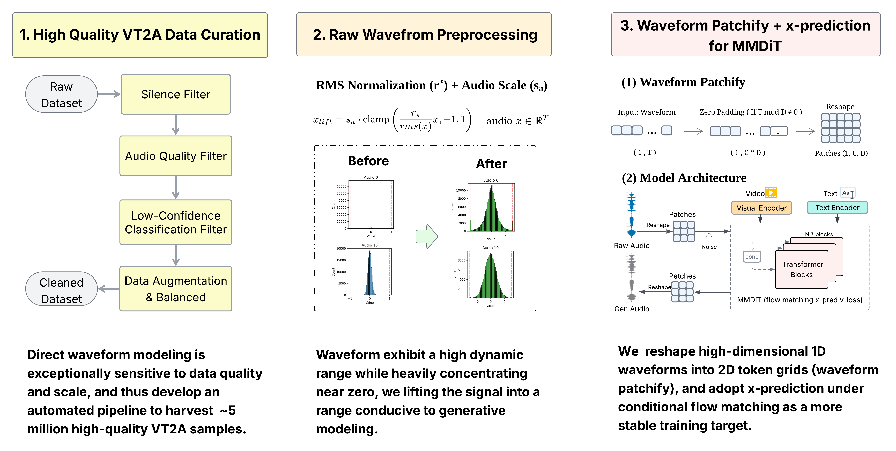

<div align="center">

<h1 align="center"><font color="#1877F2">WavFlow</font>: Audio Generation in Waveform Space</h1>

[Feiyan Zhou](https://zhoufeiyn.github.io/)<sup>1,2</sup> ·
[Luyuan Wang](https://www.luyuan.wang/)<sup>1</sup> ·
[Shoufa Chen](https://www.shoufachen.com/)<sup>1,*</sup> ·
[Zhe Wang](https://wangzheallen.github.io/)<sup>1</sup> ·
[Zhiheng Liu](https://johanan528.github.io/)<sup>1</sup> ·
[Yuren Cong](https://yrcong.github.io/)<sup>1</sup> ·
[Xiaohui Zhang](https://www.linkedin.com/in/xiaohui-zhang-79569539)<sup>1</sup> ·
[Fanny Yang](https://www.linkedin.com/in/fanny-yang-035861128)<sup>1</sup> ·
[Belinda Zeng](https://www.linkedin.com/in/belindazeng)<sup>1</sup>

<sup>1</sup> Meta AI &nbsp;·&nbsp; <sup>2</sup> Northeastern University

[**🌐 Project Page**](https://facebookresearch.github.io/WavFlow/) &nbsp;·&nbsp; [**📄 arXiv**](#) &nbsp;·&nbsp; [**🛠 Training Guide**](TRAINING.md)

</div>

---

## Overview

**WavFlow** introduces a paradigm for generating synchronized, high-fidelity audio from video and text inputs directly in the **raw waveform space**, bypassing latent compression entirely. Through *waveform patchifying* and *amplitude lifting*, WavFlow enables stable flow matching on raw audio via direct *x*-prediction. Evaluation on the VGGSound (VT2A) and AudioCaps (T2A) benchmarks shows that WavFlow delivers performance on par with established latent-based methods, proving that end-to-end waveform generation can match traditional frameworks in acoustic richness, fidelity, and synchronization.

<p align="center">
  
</p>

## Demo

<table>
<tr>
<td width="50%" align="center">

**🌳 Forest** *(natural)*

https://github.com/user-attachments/assets/9828418c-28e8-4c4c-8b93-93d5b8b57358

</td>
<td width="50%" align="center">

**🐸 Frog** *(animal)*

https://github.com/user-attachments/assets/25d1c2ed-7023-4500-bf29-223988cad4a0

</td>
</tr>
<tr>
<td width="50%" align="center">

**🥁 Drum** *(music)*

https://github.com/user-attachments/assets/3cd0fdbf-a03a-4a15-a69f-99d0c42122b1

</td>
<td width="50%" align="center">

**🛹 Skateboard** *(sport)*

https://github.com/user-attachments/assets/1c572eff-13b6-48aa-89b9-5f13a6924419

</td>
</tr>
</table>

> See the **[Project Page](https://facebookresearch.github.io/WavFlow/)** for 24+ samples and side-by-side benchmark comparisons.

## Method

<p align="center">
  
</p>

## Installation

```bash
git clone https://github.com/facebookresearch/WavFlow.git
cd WavFlow
bash scripts/setup.sh        # creates conda env 'wavflow' and installs everything
conda activate wavflow
```

<details>
<summary>Manual setup</summary>

```bash
conda create -n wavflow python=3.10 -y
conda activate wavflow
pip install -r requirements.txt
pip install -e . --no-deps
conda install -n wavflow -c conda-forge "ffmpeg<7" -y    # for torio video decoding
```

</details>

> All required external weights (CLIP, Synchformer, the empty-string CFG embedding) are downloaded or computed automatically on first run and cached under `~/.cache/wavflow/`.

## Inference

> ⚠️ Due to organizational policy constraints, we are currently unable to release the production-trained checkpoints. We are working on a foundation checkpoint trained on fully open-source data; in the meantime you can train your own — see the [training guide](TRAINING.md).

Once you have a trained checkpoint, run:

```bash
bash scripts/launch/predict.sh [--gpu N] [--config PATH]
```

The default config is `wavflow/configs/infer.yaml`. The input CSV (`data.csv_path`) accepts video, text, or both:

```csv
video_path,caption,video_exist,text_exist
/abs/path/sample1.mp4,a whistling rocket explodes,1,1   # video + text
/abs/path/sample2.mp4,birds chirping in a forest,1,1    # video + text
,a whistling rocket explodes,0,1                        # text-only
/abs/path/sample3.mp4,,1,0                              # video-only
```

<details>
<summary>Configuration reference</summary>

#### Launcher options

| Flag / env | Default | Description |
|---|---|---|
| `--gpu N` *(or `GPU=N`)* | `0` | CUDA device index |
| `--config PATH` *(or `CONFIG_PATH=...`)* | `wavflow/configs/infer.yaml` | YAML config to load |
| `WAVFLOW_ENV` | `wavflow` | conda env name to auto-activate |

Any extra positional argument is forwarded to `python -m wavflow.infer`.

#### Key fields in `infer.yaml`

| Field | What to set |
|---|---|
| `data.csv_path` | the input CSV (above) |
| `model.name` | one of `medium_16k`, `medium_44k`, `large_16k`, `large_44k` (must match the trained ckpt) |
| `model.ckpt_path` | a `checkpoint_*.pth` (full ckpt) or `ema_epoch_*.pth` (EMA-only) |
| `model.use_ema` | `true` to load `model_ema1` from a full ckpt; `false` to use the live `model` weights |
| `inference.duration_sec` / `target_sample_rate` | output length and SR (must match model arch) |
| `inference.cfg`, `num_steps`, `noise_scale`, `noise_shift`, `prediction_type`, `seed` | sampling hyperparameters |
| `inference.batch_size` | rows per ODE batch |
| `inference.trim_to_duration` | trim output to `duration_sec` |
| `output.output_dir` | where wavs are written |
| `output.loudness_norm`, `loudness_target_lufs` | optional `pyloudnorm` post-processing |

#### CSV semantics

- `video_exist=0` → uses learned empty CLIP/Sync tokens (no video decode)
- `text_exist=0` → uses learned empty CLIP-text token (caption ignored)
- Optional `id` column; otherwise the wav file name is derived from `Path(video_path).stem`, falling back to `row_<idx>` for text-only rows
- Captions with commas must be quoted

#### EMA caveat

The EMA tensor stored as `model_ema1` is updated with `ema_decay = 0.9999` per step. After only a few hundred / thousand steps it still contains random-init values and produces noise during inference. Set `model.use_ema: false` (or pass an `ema_epoch_*.pth` saved after enough steps) when sampling from a short / overfit run.

</details>

## Training

For feature extraction and training (single-node and multi-node), see **[TRAINING.md](TRAINING.md)**.

## Citation

```bibtex
@article{zhou2026wavflow,
  title   = {WavFlow: Flowing Through Waveforms for Audio Generation},
  author  = {Zhou, Feiyan and Wang, Luyuan and Chen, Shoufa and Wang, Zhe and
             Liu, Zhiheng and Cong, Yuren and Zhang, Xiaohui and Yang, Fanny and Zeng, Belinda},
  journal = {arXiv preprint},
  year    = {2026},
}
```

## Acknowledgements

WavFlow builds on the open-source community. We gratefully acknowledge:

- **[MMAudio](https://github.com/hkchengrex/MMAudio)** — multimodal audio generation
- **[JiT](https://github.com/LTH14/JiT)** — Just Image Transformer
- **[Synchformer](https://github.com/v-iashin/Synchformer)** — audio-visual synchronization

## License

The majority of WavFlow is licensed under [**CC-BY-NC 4.0**](LICENSE). Portions of the project are vendored from third-party open source projects under their original license terms (MIT, Apache 2.0, CC BY-NC 4.0, and Stability AI Community License). See [`NOTICE.txt`](NOTICE.txt) for the full per-component breakdown and license texts.
